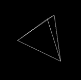

# Ready-Paint

This is a simple abstract model of wgpu drawing.

Chinese: 这个库的代码和设计并非是最优的，只是一个简单的抽象模型，便于理解和书写从第一元素到实现的编码习惯模式。

English: The code and design of this library is not the best, it is just a simple abstract model, which is convenient for understanding and writing coding habits from the first element to the implementation.


## How to use it

- [example] : [**Base**](examples/base.rs)

```bash
cargo run --example base
```

- [example] : [**Queue Ready Paint Pass**](examples/queue_ready_paint_pass.rs)

```bash
cargo run --example queue_ready_paint_pass
```

- [example] : [**Nice View**](examples/nice_view/mod.rs)

```bash
cargo run --example nice_view
```

- [example] : [**Refs Muts**](examples/refs_muts.rs)

Advance usage of the library.

In more complex logic processing, you can use this function when you need to use both immutable and mutable references in the same scope

```bash
cargo run --example refs_muts
```


<!-- ## TODO
- [TODO.md](TODO.md) -->

### Code View

```rs
pub struct NiceViewScene;
impl Queue for NiceViewScene {
    fn introduce(scene: &mut ready_paint::scene::Scene) {
        scene
            .add_ready(world::World::default())
            .add_ready(object::Tetrahedron::default());
        scene.add_paint::<PaintScene>();
    }
}
```



## Changelog

- [CHANGELOG.md](CHANGELOG.md)
